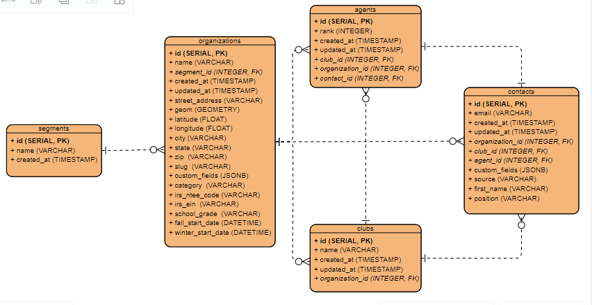

# Database Schema



For more details on the schema [see here](docs/schema.md). 

# Development checklist

- [x] Create database schema 
- [x] Create the migrations 
- [x] Read and validate data 
- [x] Make insertions
- [ ] Add indexes to tables 
- [ ] Add logging 
- [x] Add configurations 
- [ ] Dockerize application
- [x] Deploy to heroku 
- [ ] Batch insertions for better performance when dealing with large datasets (bulk insert methods or wrap the entire process in a transaction)

# Development evnvironment setup

- Clone the github repo to your local machine.
```bash
$ git clone https://github.com/s-bose7/csv-uploader.git
``` 

- Navigate to the root project directory.
```bash
$ cd csv-uploader
csv-uploader$ 
```
- Intall a python virtual environment and activate it.
```bash
$ python3 -m venv gp-db-uploader
$ source gp-db-uploader/bin/activate
(gp-db-uploader)$
```
- Install project dependecies mentioed in `requirements.txt` file.
```bash
(gp-db-uploader)$ pip install -r requrements.txt 
```
- Create a data directory in the project root folder, this folder should have the csv file that you want to upload.
```bash
$ mkdir data
```
- Create a `.env` file in the project root folder.
```bash
$ touch .env
```
- Populate the `.env` file with a set of environment variables, demonstated below:

```bash
DEV_DB_USER=postgres
DEV_DB_PASSWORD=alberteinstein
DEV_DB_HOST=localhost
DEV_DB_PORT=5432
DEV_DB_NAME=group_contacts

PROD_DB_USER=euovnrlhgaotiv
PROD_DB_PASSWORD=vbdg8b5481687cd3g13r34566861a89d27v5efhhged1512tcw4206z7f30379823
PROD_DB_HOST=a2u1tg4dvvsodf.cluster-cxx6d0kz4shl.us-east-1.rds.amazonaws.com
PROD_DB_PORT=5432
PROD_DB_NAME=f4sdf52353457r
```
Replace the credentials with right set of credentials for both development and production use case.
Obtain the production credentialas from `heroku-postgres` settings tab. 

# Using this tool progessively in the workflow

-  If you're using this tool in development environment, then I recommend you to get a guide on how to start the database container [see here.](docs/guide.md)

- In order to make an upload to the database all you need to do is run two files sequentially from your console. First file is `run_migrations.py`, which is responsible for creating and upgrading the migrations if there's any new changes found in the database schema. To run the `run_migrations.py`:
```bash
$ python3 run_migrations.py -production # pass 'development' otherwise 
```

- Second file is `main.py`, which is responsible for uploading the data to the database. To run the `main.py`: 
```bash
$ python3 main.py -production # pass 'development' otherwise 
```

- The project uses `alembic` as migration tool, all of the migration command is well abstracted, nevertheless it is encouraged to take a look at the official [documentation](https://alembic.sqlalchemy.org/en/latest/tutorial.html) for more details on alembic.